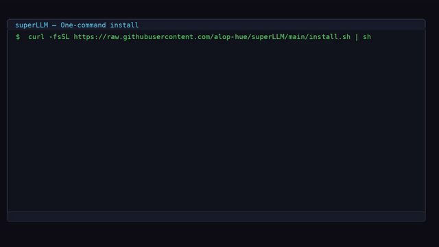

<div align="center">

# superLLM

**Local-first & cloud-capable AI platform**

Run, manage, and serve AI models — locally on your machine or in the cloud — with a single tool.

[](https://github.com/alop-hue/superLLM)
[]()

---

</div>

## Install

```bash
curl -fsSL https://raw.githubusercontent.com/alop-hue/superLLM/main/install.sh | sh
```

*A single command. No dependencies. Works on Linux & macOS.*

> **Windows** — `irm https://raw.githubusercontent.com/alop-hue/superLLM/main/install.ps1 | iex`

---

## Demo



---

## What is superLLM?

superLLM is not just a router to external APIs — it **is** the system. It serves models through its own OpenAI-compatible API, manages a local model library, runs inference on your hardware, and can route to cloud providers when needed.

### Quick Start

```bash
# Initialize configuration
superllm init

# Download a model
superllm pull llama-3.2-1b

# Chat in terminal
superllm run llama-3.2-1b

# Start the server + web UI
superllm start

# Open in browser
open http://localhost:8080
```

### Use Cloud Models

```bash
# Add OpenAI
superllm providers add --name openai --type openai --api-key sk-...

# Add Anthropic
superllm providers add --name claude --type anthropic --api-key sk-...

# Add Google Gemini
superllm providers add --name gemini --type google --api-key ...

# List providers
superllm providers list
```

---

## Features

| Capability | Description |
|---|---|
| **Local Inference** | Run models on your hardware via llama.cpp (CPU/GPU) |
| **Cloud Routing** | Route to OpenAI, Anthropic, Google, Groq, DeepSeek, Mistral, Together, xAI, and more |
| **Hybrid Mode** | Auto: local-first, fallback to cloud when needed |
| **OpenAI-Compatible API** | Drop-in replacement — use any OpenAI client |
| **Smart Router** | Task-based routing: auto, local-first, cloud-first, fallback |
| **Web UI** | Modern interface served from `localhost:8080` |
| **Model Library** | 50+ pre-configured models, searchable catalog |
| **Agents** | Tool-using agents with memory and iteration |
| **Conversations** | Persistent chat history with SQLite |
| **Audio** | Speech-to-text + text-to-speech support |

---

## CLI Reference

```
superllm init        Initialize configuration
superllm start       Start the API server + web UI
superllm pull        Download a model
superllm run         Interactive chat in terminal
superllm list        List installed models
superllm providers   Manage cloud/local providers
superllm library     Browse the model catalog
superllm doctor      Run system diagnostics
superllm config      Get/set configuration
```

## API

superLLM is a drop-in OpenAI-compatible API:

```bash
curl http://localhost:8080/v1/chat/completions \
  -H "Content-Type: application/json" \
  -d '{
    "model": "llama-3.2-1b",
    "messages": [{"role": "user", "content": "Hello!"}]
  }'
```

---

## Modes

**Local** — Models run entirely on your machine. No internet needed after download.

**Cloud** — Deploy to a server for production. Multi-user, auth, rate limiting.

**Hybrid** — Local first. Cloud fallback when a model isn't available locally.

---

## Architecture

```
┌──────────────────────────────────────────┐
│              CLI (Typer)                  │
├──────────────────────────────────────────┤
│            FastAPI Server                 │
├──────────────────────────────────────────┤
│         Inference Router                  │
│  ┌──────────────┐  ┌──────────────────┐  │
│  │ Local (llama) │  │ Cloud (LiteLLM) │  │
│  └──────────────┘  └──────────────────┘  │
├──────────────────────────────────────────┤
│  Models  │ Providers │ Conversations     │
├──────────────────────────────────────────┤
│         SQLite / PostgreSQL              │
└──────────────────────────────────────────┘
```

---

## Development

```bash
git clone https://github.com/alop-hue/superLLM.git
cd superLLM
pip install -e ".[dev]"
pytest           # 50 tests, all passing
superllm start --debug
```

## License

MIT
